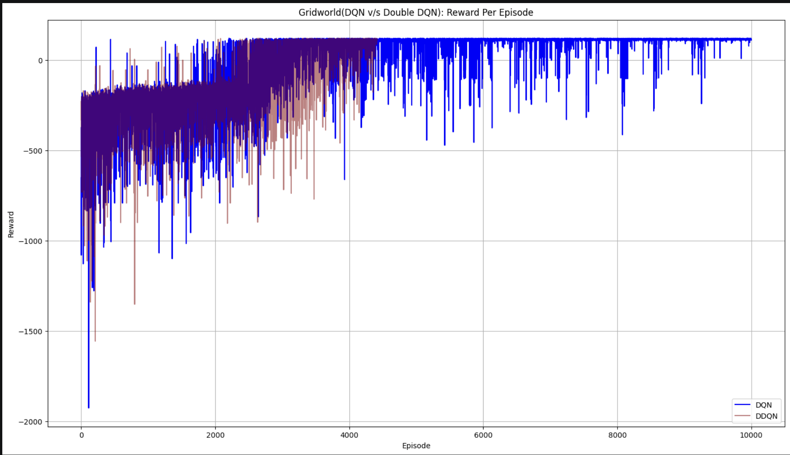
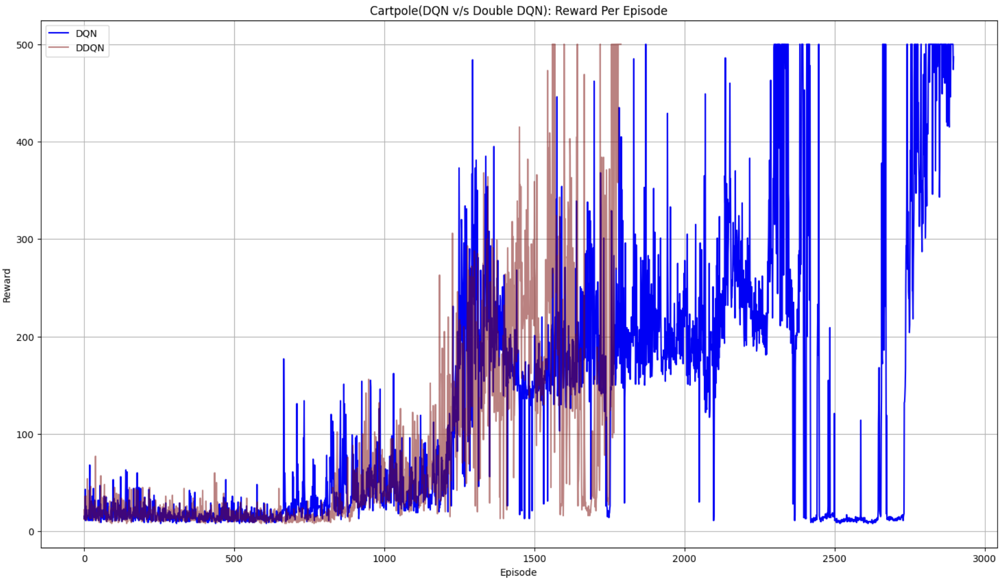
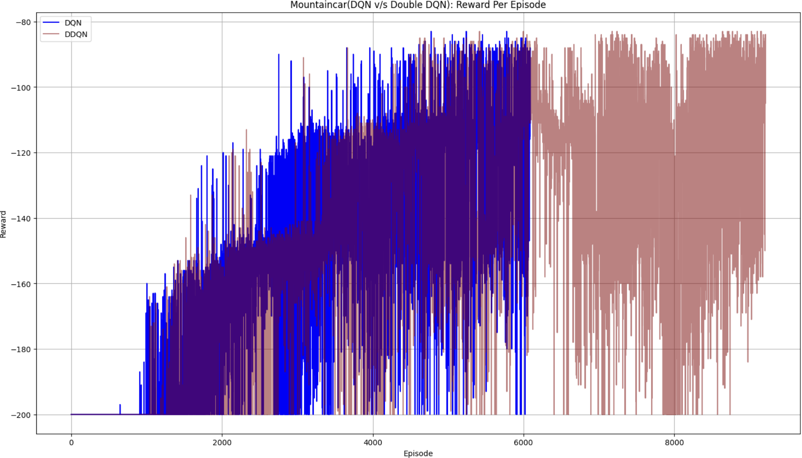

# Implementation and Comparative analysis of DQN and Double-DQN to solve OpenAI Gym CartPole and MountainCar environments

This repository contains a comprehensive analysis and implementation of **Deep Q-Network (DQN)** and **Double DQN (DDQN)** algorithms applied to various environments: Gridworld, Cartpole, and Mountain Car. The project evaluates the effectiveness of these algorithms in both discrete and continuous state spaces.

---

## Project Overview

The primary goal of this analysis was to compare the performance and convergence stability of vanilla DQN against the improved Double DQN algorithm. 

### Key Architecture Benefits

#### DQN
*   **Experience Replay**: Used to break correlation between consecutive steps by sampling random past experiences, ensuring well-rounded training without overfitting.
*   **Target Network**: Implemented to solve the "moving target" problem by fixing target Q-values for a specific number of training steps.
*   **Q-Function Approximation**: Utilized neural networks to solve continuous state environments that are untreatable with tabular methods.

#### Double DQN
*   **Double Q-Networks**: Estimation of Q-value using two networks solves the problem of overestimation, resulting into stable learning.

---

## Environments & Neural Networks

| Environment | Observation Space | Action Space | Network Architecture |
| :--- | :--- | :--- | :--- |
| **Gridworld** | Discrete (Vector size 5) | 6 Actions | 2 Hidden Layers (64 units each) |
| **Cartpole-v1** | Continuous (Vector size 4) | 2 Actions | 2 Hidden Layers (24 units each) |
| **MountainCar**| Continuous (Vector size 2) | 3 Actions | 2 Hidden Layers (128 units each) |

### Custom Modifications
*   **Mountain Car Reward**: The default sparse reward was modified to a custom energy-based reward (change in car energy - 0.01) to encourage faster completion and more constructive learning.

---

## Analysis Results

### Comparative Performance

The performance differences between vanilla DQN and Double DQN (DDQN) are best illustrated through the following comparison charts. In these graphs, the blue line represents DQN learning, the orange line represents Double DQN learning, and violet indicates the overlap region.

*   **Gridworld**: Double DQN converged significantly faster (approx. episode 4000) compared to vanilla DQN (approx. episode 8000).

<!--  -->
*   

*   **Cartpole**: Vanilla DQN showed unstable learning with larger networks due to overfitting; DDQN converged earlier at episode 1700 compared to 3000 for DQN.

<!--  -->
*   

*   **Mountain Car**: DQN converged earlier (episode 6000) than DDQN (episode 9000), likely due to network sync instability in the DDQN implementation for this specific environment.

<!--  -->
*    

### Key Findings
*   **Discrete vs. Continuous**: Discrete state environments (Gridworld) exhibited more stable learning than continuous state environments.
*   **Overestimation**: Double DQN effectively addressed the overestimation problem common in vanilla DQN, generally leading to more stable learning trends.

---

## File Structure

The repository is organized as follows:
*   `dqn.ipynb`: The primary Jupyter notebook containing all code for training and evaluation.
*   `analysis.pdf`: The detailed final report.
*   `dqn_*.h5`: Saved model weights for the vanilla DQN algorithm.
*   `ddqn_*.h5`: Saved model weights for the Double DQN algorithm.

---

## How to Use

### Prerequisites
Ensure you have the following libraries installed:
*   PyTorch
*   Gymnasium
*   NumPy
*   Matplotlib

### Running the Analysis
1.  **Clone the Repository**:
    ```bash
    git clone https://github.com/ryawr/rl-dqn-vs-double-dqn.git
    ```
2.  **Open the Notebook**:
    Navigate to the directory and open `dqn.ipynb` in your preferred Jupyter environment.
3.  **Execute Cells**: 
    The notebook is structured to define the environment, initialize the DQN/DDQN agents, and run the training loops.
4.  **Loading Models**:
    You can use the provided `.h5` files to skip training and jump directly to evaluation to see the agents in action.

---
**Author**: Rahul Yadav
```
